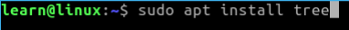
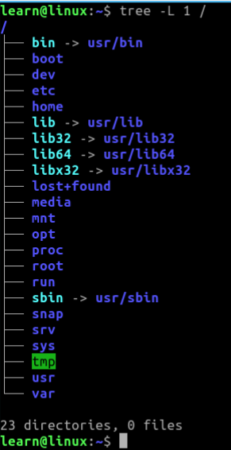

## Basics:

Like most things when you are learning for the first time, you need to get the foundational knowledge of what you are doing.  In that respect lets go over the file structure for a brief moment so we can understand what we are navigating from here on in. 

If you are on a Debian/Ubuntu based system, you most likely have ***tree*** installed already. If not, please use the following command in your terminal. 

```.sh
sudo apt install tree
```
### Example: 



Now using ***tree*** we are going to look at the linux file system from the root directory. 

_In your terminal:_

```.sh 
tree -L 1 /
```

### Example: 



Using ***tree*** is a pretty handy tool to spit out info about your file structure.  Be sure to keep it in your toolbox when you leave this page. Anyways,... Let us go over what we are looking at. 


#### Directories

***/bin*** 
    
_Common programs, shared by the system, the system administrator and the users_

***/boot***

_The startup files and the kernel, vmlinuz. In some recent distributions also grub data. Grub is a GRand Unified Boot loader and is an attempt to get rid of the many different boot-loaders we know today._

***/dev***

_Contains references to all the CPU peripheral hardware, which are represented as files with special properties._

***/etc***

_Most important system configuration files are in ***/etc***, this directory contains data similar to those in the Control Panel in Windows._

***/home***

_Home directories of the common users._

***/lib***

_Library files, includes files for all kinds of programs needed by the system and the users._

***/lost+found***

_Every partition has a ***lost+found*** in its upper directory.  Files that were save during failures are stored here._

***/media***

_External storage is automatically mounted when you plug it in and try to access it here._

***/mnt***

_This location is where you would traditionally mount storage devices or partitions, but not used as often now a days._

***/opt***

_Typically contains extra and third party software._

***/proc***

_A virtual file system containing information about system resources.  More information about the meaning of the files in ***proc*** is obtained by entering the command ***man proc*** in the terminal window.  The file proc.txt discusses the virtual filesystem in detail._

*   ***Note:*** We will also discuss the ***man*** command in more detail later. 

***/root***

_The administrative user's home directory.  Mind the difference between ***'/'***, the root directory and ***/root***, the home directory of the ***root*** user._

***/run***

_System processes use it to store temporary data for their own reasons. In other words... __KEEP OUT__._

***/sbin***

_Similar to ***bin*** but contains only applications that the superuser will need. These applications will run with ***sudo*** command that temporarily gives the user super powers (also known as Admin or root) on many distributions._


***/snap***

_By default where the files and folders from installed snap packages appear on your system. 

***/srv***

_This directory contains data for servers.  Web servers produce HTML files (***/srv/http*** or ***/srv/www***), for FTP servers your files would go into (***/srv/ftp***)_


***/sys***

_Another virtual directory like ***/proc*** or ***/dev*** and also contains information from devices connected to your computer._

***/tmp***

_Temporary space for use by the system, cleaned upon reboot, so don't use this for saving any work!_


***/usr***

_Programs, libraries, documentation etc. for all user-related programs._


***/var***

_Storage for all variable files and temporary files created by users, such as log files, the mail queue, the print spooler area, space for temporary storage of files downloaded from the Internet, or to keep an image of a CD before burning it._


