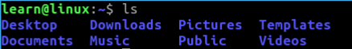
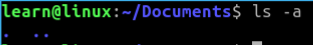
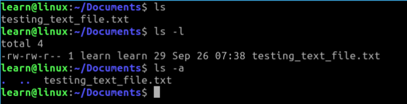
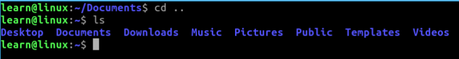
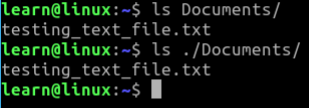
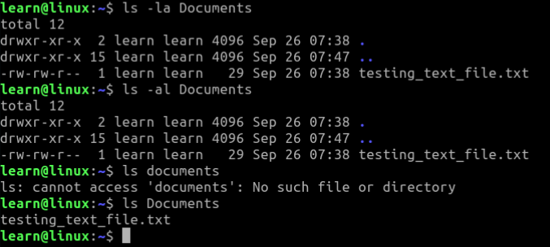

## Changing and Listing Directory Content

Moving around in the file system is the next step we are going to look at. If you are in your home directory, in the terminal you may see something like this. 

### Example: 


Notice the _***~***_ (tilde) character, this represents your home directory in the terminal.  If you do not see this we will start off by running the below command. 

```.sh
$ cd ~
```

Or in other words change directory ( ***cd*** ) to my home directory ( ***~*** ). This can be used anywhere in the file system to get you back home. 

Now let's use another command to see where we can navigate too.  In your terminal type ***ls*** (short for list). 
```.sh
$ ls
```
If you are in your home directory you should see something similar to the below image. 




These are the standard folders that come with every user directory created within your system. So later when we create users for an example to our administration purposes you will be able to see the similar structure there. For now, lets navigate into and out of some of these directories (folders).

Type the following: 
```.sh
$ cd Documents
```

Notice how the prompt in the terminal changed to now include not only the ***~*** but Documents as well? 


This is the way linux is being helpful to you and letting you know where you are at in your file system.

In your ***Documents*** directory, type out the command: 
```.sh
$ ls
```

Did you see anything? If your Documents folder is empty, you most likely just seen the prompt return with nothing between. It should look the same as if you hit enter multiple times. Now you didn't do anything wrong if this is what you are seeing, ***ls*** is just saying there is nothing in the folder for you to see. 

You can also see how many files are in this directory with the option ***l*** (lowercase L). 
```.sh
$ ls -l
```

In the output you should see _**total 0**_ if you have an empty folder or the word **total** and the number of files in the directory after it. 

However, lets look again.  This time use the option ***-a*** (lowercase A).
```.sh
$ ls -a
```

You should see something like this



What are these dots?  These dots represent the current directory ( **.** ) (one dot) and the parent directory ( **..** ) (two dots). All directories in the file system have these available for use. This means it is another method or strategy we can use to our advantage of navigation.  

For example, lets create our first document. You can do this multiple ways but I like to use **touch** but we can also use **echo** to create and place something in a document. 

###### Touch Example: 
```.sh
$ touch testing_text_file.txt
```

###### Echo Example: 
```.sh
$ echo 'Some text to throw in a file' > testing_text_file.txt
```

The only real difference to care about at this moment in these commands is **touch** just creates the file and **echo** actually creates the file and places the text inside. 

**NOTE:** _Since we are talking about **echo**, if you ran both of the commands above in the terminal you wouldn't create another file. This is because **echo** is just wanting to insert the text provided in the string into the file named **testing_text_file.txt**.  The **echo** command doesn't care if the file has been created or not because it will just create it.  This is not a problem if this is what you intended. If you had this file filled with important stuff you didn't want to lose, **echo** will overwrite this because we used the **>** (greater than) operator. This tells **echo** to just write to whatever it is pointing to on the other side of the command. If we use double greater than operators **>>** it will append to the end of the document it is pointing to. You can take some time and play around with this so you can get an understanding of this idea, but we will touch on it again in later topics._

Now that we have a file in the directory lets run all the above **ls** commands again. 

```.sh
$ ls
```
```.sh
$ ls -l
```
```.sh
$ ls -a
```

You should see something similar below. 



* **ls** -> prints out a list of files and folders in the directory. 
* **ls -l** -> prints out the total number of files and folders in a directory using the long listing format. 
* **ls -a** -> prints out the total number of files and folders in a directory and doesn't ignore hidden directories like the current directory ( **.** ) or the parent directory ( **..** ). ( **-a** also all)

The output of some of these can look a little odd or intimidating at first if you aren't use to seeing your pc file system in this kind of light, for example (**-rw-rw-r-- 1 learn learn 29 Sep 26 07:38 testing_text_file.txt**). 
Don't worry though this will be covered in later discussions. 

There are a bunch of options available for the **ls** command.  You can see more of them by viewing the manual for the **ls** command by typing in your terminal. 
```.sh
$ man ls
```

As stated before, this is a great way to see what a command is capable of before going out to the internet for solutions. Although, do go out to the internet if needed and for more uses and ideas from others.  

Carrying on!

Let's move out of the Documents directory: 
```.sh
$ cd ..
```
Yes I just used the parent directory ( **..** ) to move back to my home folder. Let's also list (**ls**) out the current home folder again to prove where we are in the file system.



We can also see again our prompt has also changed to reflect our location. We are setting back to just the ( **~** ) or home.

Cool thing is if we need to still see in the **Documents** folder we can still do that from here by using the **ls** command. 

```.sh
$ ls Documents
```
Lets do another one with our current directory (sometimes called relative) ( **.** ). 
```.sh
$ ls ./Documents
```



Notice the output to the screen is the same with or without the relative path.  This is just another way of saying, **"List the contents of the Documents folder from my current directory"**. 


We can also use our options from other directories.  We just need to add them. 

```.sh
$ ls -la Documents
```

or 

```.sh
$ ls -al Documents
```

This is just a preference of the user, the terminal doesn't care about order. Although, it is case sensitive. 

```.sh
$ ls documents
```


Notice when I used the lowercase d when trying to access the Documents folder, the prompt tried to again be helpful by letting me know that it couldn't find it. 

### Summary

Navigating the file system in the terminal is done with the (**cd**) command.  You can change directories by typing **cd** **<directory_name_here>**. 

Directories contain both the current (relative) ( **.** ) and parent paths ( **..** ). 

Listing out the contents of a directory is just as easy with the (**ls**) command, and you don't have to be in the directory to use it. The (**ls**) command has many options and can be explored by using the **man** command to view the manual page for **ls**. 

