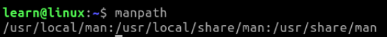

## Getting Help

No matter if you are a novice or a seasoned user, we all need help from time to time. There are tons of commands out there in the real world and more being created everyday. How on earth would it be possible to keep up with all these commands and how to use them, much less to always use them in the most efficient way. I'm going to say that unless you have been augmented in some way cybernetically to retain this information, have a photographic memory, or possibly from another higher evolved species this is not possible. Although, if you fall into one of these categories, "_Hello to you from earth_". 

However, some other ways to find the information we need before going out to phone a friend or start our googling frenzy is to use the ***man*** pages. Short for **Manual**, these pages are super helpful if you need to look at options for a command that you are using and can be printed directly to the console so you never have to leave the terminal. 

The **man** pages follow a common layout and it is recommended that you use the same for your man pages if you decide to create some later. 

**NAME**
*   The name of the command or function, followed by a one-line description of what it does.

**SYNOPSIS**
*    In the case of a command, you get a formal description of how to run it and what command line options it takes.

**DESCRIPTION**
*   A textual description of the functioning of the command or function.

**EXAMPLES**
*   Some examples of common usage.

**SEE ALSO**
*   A list of related commands or functions.

**BUGS**
*   List known bugs.

**AUTHOR**
*   Specify your contact information.

**COPYRIGHT**
*   Specify your copyright information.


Of course, if you build your own, other fields can be added that you think are important. After all, it is your application/script you are making and users need to be informed if you plan to share and take the time to make a man page. The above list just at least should be included as a best practice. 

There are also a few numbered sections that are described in the man page. 

| Section | Description                                     |
|---------|-------------------------------------------------|
|**1**    |_Executable programs or shell commands_          |
|**2**    |_System calls (functions provided by the kernel)_|
|**3**    |_Library calls (functions within program libraries)_|
|**4**    |_Special files (usually found in /dev)_          |
|**5**    |_File formats and conventions, e.g. /etc/passwd_ |
|**6**    |_Games_                                          |
|**7**    |_Miscellaneous (including macro packages and conventions), e.g. man(7), groff(7)_|
|**8**    |_System administration commands (usually only for root)_|
|**9**    |_Kernel routines [Non standard]_|


You can see this information and more in your terminal straight out of the box from any linux distribution. All you have to do is run the below command. 

```.sh
$ man man
```
Yes, the manual has a manual... moving on...

The system usually stores **man** pages in the **_/usr/share/man_** directory. It is best practice to store your own man pages you create for your scripts in **_/usr/local/man_** directory. 

To view all the paths already available to you, you can use the **manpath** command. 
```.sh
$ manpath
```
* **Note:** **manpath** also has a **man** page. 
```.sh
$ man manpath
```
### Example: 


We will come back to **man** pages a little later and build our own with some of the projects later in this course. For now, take some time to look over the manual for the man page. The command again is the,...

```.sh
$ man man
```

### Summary

Man pages are useful when you are using a command and need a little extra help in how to use it. You can view this by using the **man \<some command we want to view here\>** to print out information to the terminal. 

**Manpath** shows the paths to **man** file locations that are already defined, and we will learn more about this later in the projects section of the course. 


Previous Section:  [_Changing and Listing Directory Content_](../1.Navigation/b.Changing_and_Listing_Directory_Content.md)

Next Section: [_Install New Applications_](./b.Install_New_Applications.md)