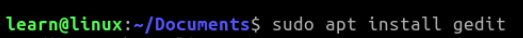
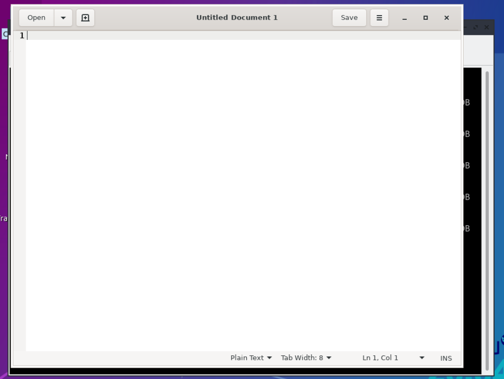
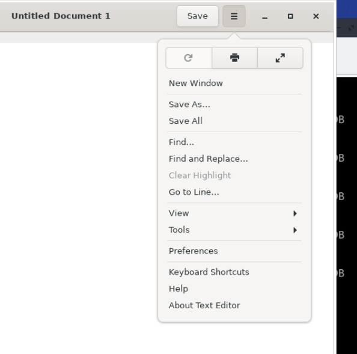
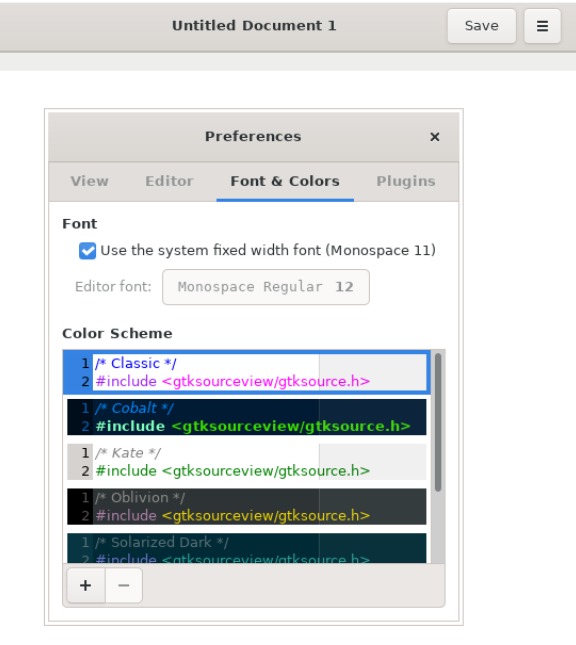
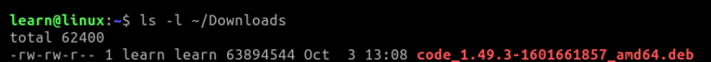

## Install New Applications

If you are going to use any operating system, you will need the knowledge of installing and uninstalling applications.  Apps after all, are what uses the resources of your OS to help produce meaningful objects and constructs to us as users. For the projects and lessons ahead we will need to install some applications.  For debian based systems there are a few package managers that we can use, but we will go over the main ones here. 

### _Debian Package Manager_ (dpkg)

Debian based systems have access to their vast package library, and you can see a list of available stable packages [here](https://packages.debian.org/stable/).  Also using a debian based system you will run into the common **.deb** file extension.  This is the executable for debian and often can just be installed by double clicking the file from the GUI (Graphical User Interface), but sometimes you need to do it from the terminal. This is where **dpkg** comes in handy. 

### _Advanced Package Tool_ (apt)

The main command-line package manager for Debian based systems.  It provides tools for searching, managing, and querying information about packages within your system. Super handy tool for the toolbox and you will most likely see this option chosen over the former mention (dpkg).


**Author Note:** learning about bash or the shell is super useful. It is even better if you force yourself to use it more instead of relying directly the GUI all the time. The commands that will most likely follow in this course can be done pretty easy from any GUI but trying to find ways to use the shell will benefit you more as you learn through reading this material. With that said, you may see something from here on out noted as **_Challenge Section_** above with some extra notes to try.  Then a link to the particular challenge in how I solved it. Of course, this is not mandatory but just meant to help with the understanding. 

#### Gedit (Text Editor)

Gedit is a nice and easy to use text editor, it doesn't have a large footprint and has syntax highlighting for certain languages. We will install it through the shell with **apt**. 

```.sh
$ sudo apt install gedit
```


After this is installed you can actually just use it by typing **gedit** in the terminal. 

```.sh
$ gedit
```

If is was installed successfully you should see something like this below. 




If you would like a darker look or to change the settings for your standard **gedit** window, it can be done in the preferences section. 
1. Click on the hamburger (3 stacked lines) button next to the **Save** button.  

2. Go down to **Preferences**



3. On the **Fonts & Colors** tab choose your color preference. 



I'm going to select **Cobalt**. Then just close the window, and the changes are automatically applied. 


###  Visual Studio Code (or your choice of text editor)

Alternatively you can install Visual Studio Code by Microsoft. This is a great product you are wanting a great editor with a large community and plugins. Navigate to your browser, and once launched type in the search box **vscode**.  After you get your search results back, it should be the first or second option. Click into the link and download the appropriate package for your system. It will be the download with the extension of **.deb** as described previously. 


## _Challenge Section_
Instead of using the GUI (Graphical User Interface) to find **vscode**, use your shell terminal to launch your browser and search for **vscode**. 
*   **_Hint_**: Firefox is typically installed by default and can be opened directly in the terminal by just typing: 
```.sh
$ firefox
```
See if you can figure out the rest of the command to do your search, and that is all for this challenge. 

Need help? [See how I approached this](../challenges/a.launch_search_from_browser.md)


After you have downloaded the **.deb** package lets navigate to it in our terminal. By default this should be in your **~/Downloads** folder. 

We can see it is there by using one of the commands we learned earlier. 

```.sh
$ ls -l ~/Downloads
```

The above should give you a print out of the long form of the files similar to the below. 



We can now use the **dpkg** to install this **.deb** file. 
```.sh
$ sudo dpkg -i ~/Downloads/code_1.49.3-1601661857_amd64.deb
```
You will need to use the **sudo** command because this will take administrative (root) privileges since we are altering the state of the system. After you type in your password you should be able to confirm it's installation by typing: 
```.sh
$ code --version
```
If you just went through this section and don't really want to keep Visual Studio Code, you can simply uninstall it. 

```.sh
$ sudo dpkg -r code
```
You can then confirm uninstall by running the version command again and you should get something back that says **"No such file or directory"**.


