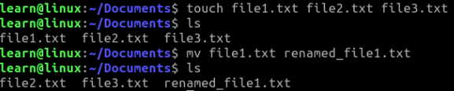
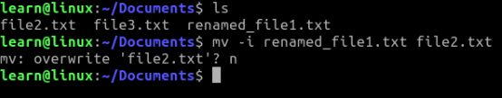
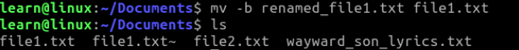
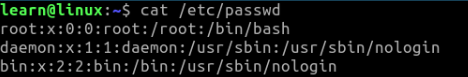
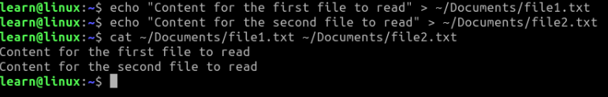
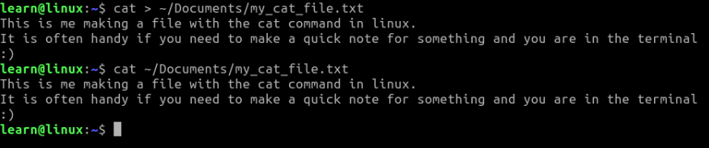
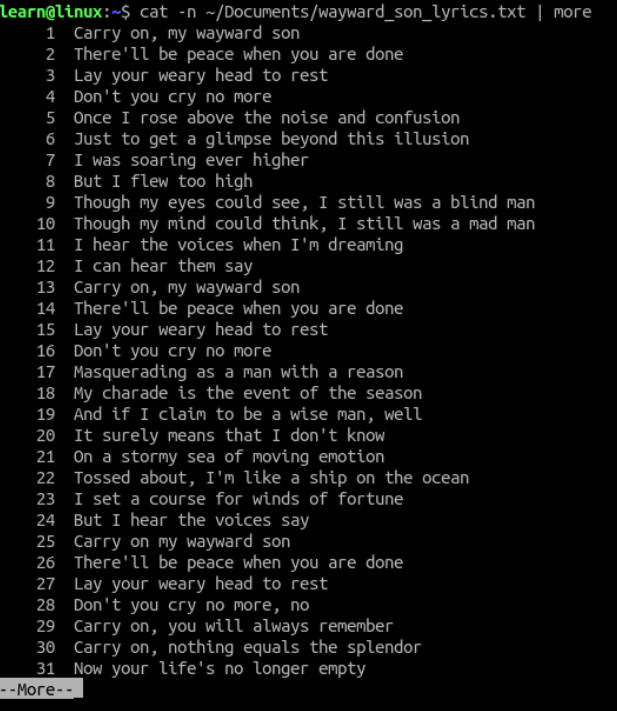
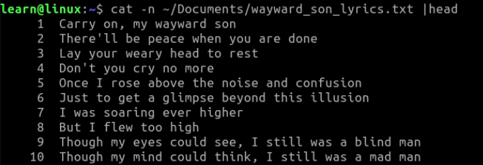
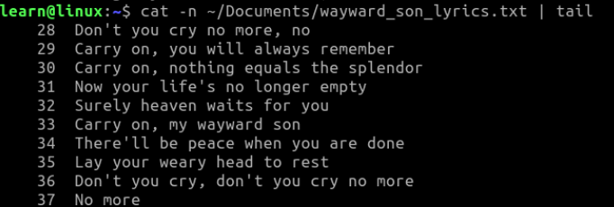

## Basic File Commands

File commands will be probably some of the most used commands in your linux environment, because we do literally everything with files on a pc.  It is where we store the information needed to help us with our daily lives, pictures, music, videos, and code to run the OS or Distro we are using.  We have already went over a few commands that would help us with navigation and using or creating files such as "**cd**" , "**ls**", and "**touch**". In this section we are going to look at the following commands. 

- **mkdir**
- **rm**
- **cp**
- **mv**
- **cat**

#### File Handling

- **mkdir** -> Make a directory by using this command and the name of the folder you wish to create.   
  
  **TIP:** Since we use the shell so much on linux it is good to make your directories and files all one solid chunk of text just for ease of administration but you can use spaces as well with quotes.  If you use spaces though, you will have to use them each time you access the directory or file. 
  
  ```.sh
  $    mkdir my_new_directory
  ```
  
  With spaces example:
  
  ```.sh
  $    mkdir "My New Direcotry"
  ```

- **rm** -> Remove files or directories with the "**rm**" command.  
  
  ```.sh
  $    rm file.txt
  ```
  
  Remove empty directories
  
  ```.sh
  $    rm -d directory_to_remove
  ```
  
  Remove directories that aren't empty
  
  ```.sh
  $    rm -R directory_with_files_inside
  ```
  
  **TIP:** If you use rm to remove a file, it might be possible to recover some of its contents, given sufficient expertise and time.  If you wish to have contents truly unrecoverable, consider using **shred**. 
  
  **Challenge:**  Use the **man** command to read about the **shred** and learn why it is different than **rm**. 

- **cp** -> Copy files or directories from one location to another.  It does this by following the usual rule of **cp [Options] Source... Destination** layout in the command. 
  
  ```.sh
  $    cp ~/Downloads/my_pic.png ~/Pictures
  ```
  
  When you only use the directory that you wish to copy the file to, it will copy it with the same name as the name you copied from.  So the new .png file will be named my_pic.png in the Pictures folder. 
  
  You can rename the file by specifying it when you copy. 
  
  ```.sh
  $    cp ~/Downloads/my_pic.png ~/Pictures/my_new_pic.png
  ```
  
  When copying a file the new file is owned by the user running the command.  You can preserve the file mode, ownership, and timestamps by using the **-p** option. 
  
  ```.sh
  $    cp -p ~/Downloads/my_pic.png ~/Pictures/my_new_pic.png
  ```
  
  If you need to copy something to a folder that doesn't exist already you can use the **-R** option to create the directory and copy the contents inside. 
  
  ```.sh
  $    cp -R ~/Downloads/my_pic.png ~/Pictures/New_Folder/my_new_pic.png
  ```
  
  Copy only files and subdirectories with the additional **-T** option. 
  
  ```.sh
  $    cp -RT ~/Downloads/my_pic.png ~/Pictures/New_Folder/my_new_pic.png
  ```
  
  Copy multiple files to a single directory
  
  ```.sh
  $    cp file1.txt file2.txt dir1
  ```

- **mv** -> Move uses a similar layout as **cp** to work out the commands. 
  - Example: **mv [Options] source destination**

  We can rename a file with the **mv** command. 

  Let us make some files to view and rename, list them out for view, rename a file, and list them again. 

  ```.sh
  $   touch file1.txt file2.txt file3.txt

  $   ls

  $   mv file1.txt renamed_file1.txt

  $   ls
  ```
	Output of the above commands. 

  
  
	Pretty neat right? In the above command we just changed the name of the file, but if there were to be a file named the same in the directory we were in, it will overwrite this file without warning. So be careful when using this command. 

	A more careful approach to using the **mv** command is to use the **-i** option. This prompts the user before overwriting a file if the name exists in the directory before moving. 

	```.sh
	$	mv -i renamed_file1.txt file2.txt
	```

	

	This way we can back out if we see something that doesn't look right. 

	Using the **-b** __(backup)__ option will backup an existing file appending it with the tilde **~** character. 

	```.sh
	$	mv -b renamed_file1.txt file2.txt
	```
	

	If we want to go in the other direction we can use the **-f** flag to overwrite write-protected files.

	```.sh
	$	mv -f renamed_file1.txt file2.txt
	```

	There are more options that can be explored by using **man mv** in your terminal but the above will cover most use cases. Feel free to play around with this powerful command and it's other flags available. 


#### File Reading

- **cat** -> Short for **concatenate** and probably one of the more frequently used commands. **cat** allows us to create single or multiple files, view file contents, concatenate files, redirect output in the terminal or files, etc. 

	Example Syntax: 

	```.sh
	$	cat [option] [file]
	```
	Display the contents of a file

	```.sh
	$	cat file_name
	```

	

	View multiple file contents with one command. In the below code we will create two files and add content so we can **cat** them together. 
	
	```.sh
	$	cat file1 file2
	```

	

	In the above example we used echo to push text to our documents but we could have used **cat** for this as well. 

	```.sh
	$	cat > file
	```

	The **cat** command will wait for you to type something into the terminal after running this command. After you are done just press Ctrl+D to finish.  The text you entered will then be recorded to the file you directed it to. See below. 	

	

	**cat** can also append data to a file by adding another **>** into the command so the original file isn't overwritten. 

	```.sh
	$	cat >> file
	```

	You can review large text files with number lines if you would like with the **-n** option and **| (pipe)** it into the **more** command. Below we are going to print out the song lyrics from a large file. 

	```.sh
	$	cat -n file | more
	```
	
	
	After using the command we can hit enter to cycle through the document until we reach the end. 
	
	We can also just read the top portion **(head)** or the end of the file **(tail)** using the appropriate commands. 
	
	```.sh
	$	cat -n file | head
	```

	

	```.sh
	$	cat -n file | tail
	```

	


## Summary

In this section we spoke about creating with **mkdir**, copying with **cp**, moving with **mv**, and removing directories with **rm**. How to read 	files with **cat** and send that output to another file if needed. We learned that we can read any portion of a file that we wish to see with the commands **head, tail,** and **more**. These commands are just a few to add to your toolbox of file handling. As you progress and get more comfortable with the command line, the more tools you will look for.  All the commands we have spoke about in this course comes with a **man** page or a **help** or **info** command. Look into these documents before expanding on your tools for use, because these foundational commands are very powerful.  

Previous Section:  [_Basic Searching_](../2.Finding_Things/c.Basic_Searching.md)

Next Section: [_Compression and Archives_](./b.Compression_and_Archives.md)